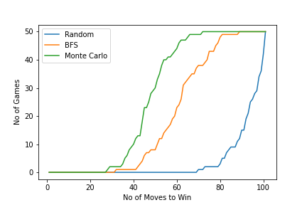

# battleships-solver

Collection of Algorithmic methods to play the strategic game of Battleships. We implement and evaluate the following 3 methods: 

* Random Move - Pick a Cell at random
* BFS based approach - Once you find a Ship Cell, search across its edges
* Monte Carlo Sampling - Generate Proabability Maps for maximising the chances of hitting a ship in every move.

## Evaluation

### Expected Moves to Victory

|                       |  Random Strategy |  BFS  | Monte Carlo Sampling |
|:---------------------:|:----------------:|:-----:|:--------------------:|
| Expected Moves to Win |       92.3       | 60.78 |         47.12        |

###
We implement and emulate games for each method. The following plot displays the performance of each of the three methods. On x axis is the number of moves to win and on y axis is a cumulative count of games.

